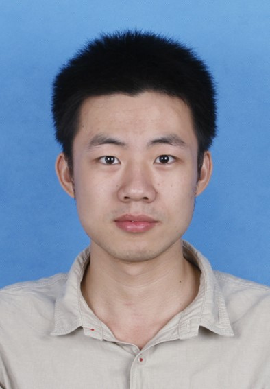

- 程昌新/男/1993.08.05

- 手    机：15652932816          

- E-mail：chengcx1019@gmail.com 

- QQ/微信号：525794244/ccx1993jia

- 个人博客：[http://changxin10m.com/](http://changxin10m.com/)

- gitgub：[https://github.com/chengcx1019](https://github.com/chengcx1019)

- 爱    好：跆拳道、跑步

- 期望职位：大数据研发工程师/算法工程师

***

**教育经历**

2016/09– 至今

北京科技大学 | 计算机技术 | 硕士研究生

2012/09– 2016/06

北京科技大学 | 计算机科学与技术 | 本科

****
**横向项目**

2017.10- 2018.7 **中铝瑞闽智能制造新模式-智能决策系统**

中铝瑞闽与实验室合作的大数据智能决策项目。在项目申请初期，作为主要设计人，设计了hadoop为历史数据存储平台，抽取企业大量离散的OLTP事务系统，并在学校钢铁协同中心的云平台同步搭建了四个节点的hadoop平台作为实验平台，并以此为数据基础，在oracle数据库中构建为以质量、成本、客户和绩效四大主题为核心的数据仓库，为分析业务提供数据支持，应用层以python为基础，构建BS系统，进行数据分析及展示工作，该方案经过反复的修改与讨论，最终通过中铝集团技术委员会审定，成功签下该项目；之后作为主要负责人，带领5人的团队深入企业进行了为期3周的需求调研工作，实际走访瑞闽公司的各个部门确定需求，并根据需求用html制作原型系统，完成了该阶段工作。

2016.9- 2017.6 **青岛特钢基于大数据的集团智能决策支持系统**

2016年开始参与与青岛特钢合作的“基于大数据的集团智能决策支持系统”开发。前期作为后台开发，编写了通用数据库查询的工具方法，进行数据仓库的构建工作，并在青特钢的虚拟化云平台搭建了hadoop平台，抽取历史数据。后来作为主要开发者，完成了网站界面整体的设计实现，可视化模块集成，网络爬虫实现，带领主要5人的开发团队进行B/S系统开发，基于github进行项目成员间协作，完成了钢铁炼钢转炉工序质量问题原因追溯分析，包括工序多关联因素整合，关联分析和回归分析定位质量问题，并对数据可视化。项目完成后，选取了系统的结构设计及质量回归预测部分的内容发表论文《Iron and Steel Enterprise Big Data Visualization Analysis Based on Spark》。

****
**科研经历**

2017.9- 至今 **基于数据驱动的SPH流体仿真**

课题是实验室申请2018年国家自然科学基金的基础，3维流体仿真是实验室的一个主要方向，我们已经成功的使用基于物理的方法——传统的基于光滑粒子流体动力学SPH对流体的运动进行计算机图形学模拟，为提升流体仿真效率，减少粒子状态量相关的运算时间，结合机器学习研究能够对粒子下一时刻状态进行预测的深度学习方法。

物理仿真过程会生成海量离散的中间计算数据，我提出适合SPH方法的粒子特征建模方式，根据粒子3维空间坐标及其当前帧状态，在tensorflow平台上使用卷积深度网络学习构建基于上下文的积分特征，在此过程中，由于对大量数据处理的要求，对tensorflow平台的使用有了熟练掌握，之后采用回归方法建模粒子的真实受力状态，并预测粒子的下一时刻状态。

2017.10- 2018.3 **面向多元素场景的高效数据驱动流体仿真**

国家自然科学基金2018年申请项目，作为主要参与人提出项目的研究内容、研究目标及研究方法；以物理方法为基础，此次基金的研究内容主要是利用机器学习的方法，结合物理仿真的数据，实现面向多元素场景的高效数据驱动流体仿真，基金的主要内容分为三个部分：物理约束下流体特征结构建模，基于流体动力学求解器的回归森林建模和多元素场景仿真模型迁移，我负责第二部分的全部内容，提出并构建基于三种不同物理仿真方法构建三棵不同决策树的随机森林方法。
